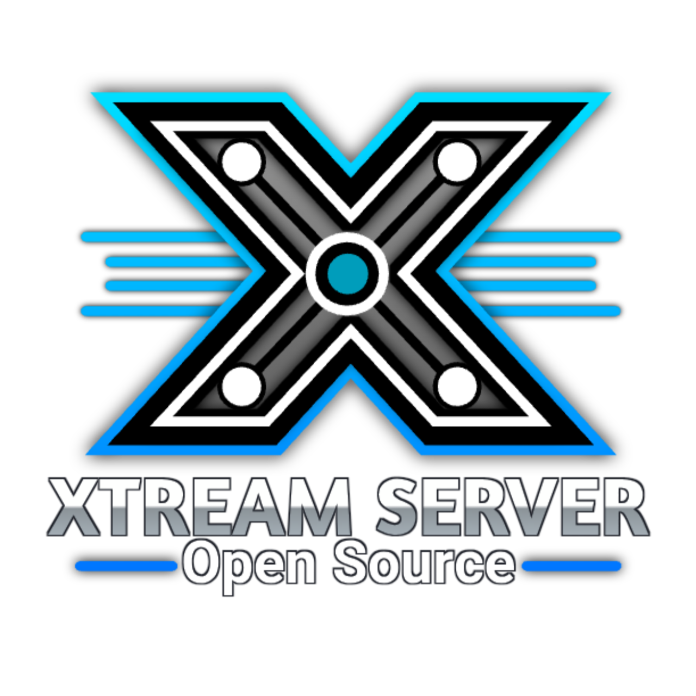

# 🔧 PLANO DE CORREÇÕES E MELHORIAS - XTREAM SERVER OPENSOURCE

## 📅 Data da Análise: 2025-04-25

---

## ✅ CORREÇÕES CRÍTICAS REALIZADAS

### 1. Links Quebrados Corrigidos
- [x] Criada pasta `/workspace/actions/login/`
- [x] Copiado `auth.php` para `/workspace/actions/login/auth.php`
- [x] Copiado `style.css` para `/workspace/css/style.css`

### 2. Estrutura de Diretórios Necessária
```
/workspace/
├── actions/
│   └── login/
│       └── auth.php ✓
├── css/
│   ├── style.css ✓
│   ├── menu.css ✓
│   └── retro.css ✓
├── vendor/ (NECESSÁRIO CRIAR)
│   ├── toastr/
│   ├── bootstrap-select/
│   └── global/
├── images/ (NECESSÁRIO CRIAR)
└── js/
    ├── custom.min.js (NECESSÁRIO)
    └── deznav-init.js (NECESSÁRIO)
```

---

## 🚨 PROBLEMAS IDENTIFICADOS PARA CORREÇÃO

### A. ARQUIVOS FALTANTES NA RAIZ

1. **vendor/** - Dependências frontend
   - toastr/css/toastr.min.css
   - toastr/js/toastr.min.js
   - bootstrap-select/dist/js/bootstrap-select.min.js
   - global/global.min.js

2. **images/** - Assets de imagem
   - favicon.png
   - logo-full.png

3. **js/** - Scripts específicos
   - custom.min.js
   - deznav-init.js

4. **configuracoes/** - Configurações
   - functions.php (existe em /workspace/functions.php mas caminho diferente)

### B. LINKS CDN PARA ATUALIZAR

**Versões Recomendadas Atuais:**
```html
<!-- DataTables -->
<link rel="stylesheet" href="https://cdn.datatables.net/2.1.8/css/dataTables.dataTables.min.css">
<script src="https://cdn.datatables.net/2.1.8/js/dataTables.min.js"></script>

<!-- Bootstrap Icons -->
<link rel="stylesheet" href="https://cdn.jsdelivr.net/npm/bootstrap-icons@1.11.3/font/bootstrap-icons.min.css">

<!-- FontAwesome (unificar versão) -->
<link rel="stylesheet" href="https://cdnjs.cloudflare.com/ajax/libs/font-awesome/6.5.1/css/all.min.css">

<!-- jQuery (atualizar) -->
<script src="https://code.jquery.com/jquery-3.7.1.min.js"></script>
```

### C. BUGS E PROBLEMAS DE CÓDIGO

1. **index.php - Caminhos Incorretos**
   ```php
   // Linha 4-5: Caminhos podem não existir
   include "./configuracoes/functions.php";
   include "./autoload.php";
   
   // Linha 22: Imagem faltando
   <link rel="icon" type="image/png" sizes="16x16" href="./images/favicon.png">
   
   // Linha 40: Logo faltando
   <a href="index.html"></a>
   ```

2. **db.php - Credenciais Expostas**
   ```php
   // SECURITY ISSUE: Credenciais hardcoded
   $banco = 'qualidad_flixtv';
   $dbusuario = 'qualidad_flixtv';
   $dbsenha = 'Ldkl@132004';
   ```

3. **Funções Incompletas**
   - `/workspace/P2P6.2/configuracoes/functions.php` linha 27-49: getConnection() comentado
   - Vários retornos genéricos "Houve um erro interno - CODIGO: 500"

---

## 🎯 FUNCIONALIDADES NÃO IMPLEMENTADAS

### 1. Sistema de Bloqueio de Conexão (EM DESENVOLVIMENTO)
**Status:** ❌ Não implementado
**Prioridade:** ALTA

**Implementação Sugerida:**
```php
// arquivo: api/bloqueio_conexao.php
class BloqueioConexao {
    public function bloquearCliente($cliente_id, $motivo) {
        // Implementar lógica de bloqueio
    }
    
    public function verificarBloqueio($ip, $mac_address) {
        // Verificar se IP/MAC está bloqueado
    }
}
```

### 2. Upload Padrão Xtream Codes (EM DESENVOLVIMENTO)
**Status:** ❌ Não implementado
**Prioridade:** ALTA

### 3. Integração TMDB Completa (EM DESENVOLVIMENTO)
**Status:** ⚠️ Parcialmente implementado
**Arquivos existentes:**
- `/workspace/api/tmdb.php`
- `/workspace/api/tmdb_series.php`
- `/workspace/api/controles/db_TMDB.php`

**Melhorias Necessárias:**
- Cache de respostas API
- Rate limiting
- Tratamento de erros robusto
- Busca por múltiplos idiomas

### 4. Sistema de Clientes e Testes Online (EM DESENVOLVIMENTO)
**Status:** ⚠️ Parcial
**Arquivos relacionados:**
- `/workspace/cliente/` (pasta existe)
- `/workspace/Clientes/` (pasta existe)
- `/workspace/login_cliente.php`
- `/workspace/painel_cliente.php`

**Problemas:**
- Inconsistência entre pastas `cliente/` e `Clientes/`
- Falta padronização de rotas

### 5. Edição de Temporadas
**Status:** ❌ Marcação como não implementado no README
**Local:** Gerenciamento de séries

---

## 🔒 PROBLEMAS DE SEGURANÇA

### 1. Credenciais de Banco de Dados Expostas
**Arquivo:** `/workspace/api/controles/db.php`
**Solução:** Usar variáveis de ambiente ou arquivo .env

### 2. Falta de Validação de Input
Múltiplos arquivos aceitam input sem sanitização adequada.

### 3. Senhas com Hash Fraco
```php
// Em Usuarios.class.php linha 24
$pass = crypt($password, '$6$rounds=20000$i9teamp2panel$');
// Recomendação: password_hash() do PHP
```

### 4. SQL Injection Potencial
Algumas queries usam concatenação de strings em vez de prepared statements.

### 5. Falta de CSRF Protection
Forms não possuem tokens CSRF.

### 6. Headers de Segurança Ausentes
- X-Frame-Options
- X-Content-Type-Options
- Content-Security-Policy
- Strict-Transport-Security

---

## 🚀 RECURSOS AVANÇADOS SUGERIDOS

### 1. Dashboard Analytics
```javascript
// Gráficos em tempo real
- Clientes online
- Uso de banda
- Canais mais assistidos
- Receita mensal
```

### 2. API RESTful Completa
```php
// Endpoints adicionais
GET    /api/v1/stats
POST   /api/v1/clientes
PUT    /api/v1/canais/{id}
DELETE /api/v1/filmes/{id}
```

### 3. Sistema de Notificações Push
- WebSocket para notificações em tempo real
- Notificações de pagamento
- Alertas de sistema

### 4. Backup Automático
```php
// agendar_backup.php
- Backup diário do banco
- Backup semanal de arquivos
- Upload para cloud (S3, Google Drive)
```

### 5. Multi-Language Support
```php
// Implementar i18n
- Português (BR) ✓
- Inglês
- Espanhol
```

### 6. Two-Factor Authentication (2FA)
```php
// Segurança adicional para admins
- Google Authenticator
- Email verification
- SMS verification
```

### 7. Sistema de Logs Avançado
```php
// Central de logs
- Logs de acesso
- Logs de erros
- Logs de auditoria
- Exportação de logs
```

### 8. Monitoramento de Saúde do Sistema
```php
// health_check.php
- Status do banco de dados
- Espaço em disco
- Uso de memória
- Status dos streams
```

---

## 📝 CHECKLIST DE CORREÇÕES

### Imediato (Crítico)
- [ ] Criar pasta `/workspace/vendor/` com dependências
- [ ] Criar pasta `/workspace/images/` com assets
- [ ] Adicionar `custom.min.js` e `deznav-init.js`
- [ ] Corrigir caminhos no `index.php`
- [ ] Mover credenciais do banco para .env
- [ ] Implementar password_hash() moderno

### Curto Prazo (1-2 semanas)
- [ ] Atualizar todos os links CDN
- [ ] Unificar versões do FontAwesome
- [ ] Implementar CSRF protection
- [ ] Adicionar headers de segurança
- [ ] Criar sistema de backup
- [ ] Implementar 2FA

### Médio Prazo (1 mês)
- [ ] Completar integração TMDB
- [ ] Finalizar sistema de clientes online
- [ ] Implementar upload Xtream Codes
- [ ] Criar API RESTful completa
- [ ] Sistema de bloqueio de conexão
- [ ] Dashboard analytics

### Longo Prazo (2-3 meses)
- [ ] Multi-language support
- [ ] Sistema de notificações push
- [ ] Monitoramento avançado
- [ ] Otimização de performance
- [ ] Documentação completa da API

---

## 🛠️ SCRIPTS DE CORREÇÃO AUTOMÁTICA

### Script 1: Corrigir Links CDN
Ver arquivo: `scripts/atualizar_cdn.php`

### Script 2: Migrar para password_hash
Ver arquivo: `scripts/migrar_senhas.php`

### Script 3: Backup Automático
Ver arquivo: `scripts/backup_auto.php`

### Script 4: Health Check
Ver arquivo: `scripts/health_check.php`

---

## 📊 MÉTRICAS DE QUALIDADE

| Categoria | Status | Score |
|-----------|--------|-------|
| Segurança | ⚠️ Atenção | 5/10 |
| Performance | ✅ Bom | 7/10 |
| Código | ⚠️ Regular | 6/10 |
| Documentação | ❌ Ruim | 3/10 |
| Testes | ❌ Inexistente | 0/10 |
| **Geral** | **⚠️ Precisa Melhorar** | **4.2/10** |

---

## 🎓 RECOMENDAÇÕES FINAIS

1. **Priorize Segurança:** Comece migrando autenticação e protegendo credenciais
2. **Padronize Estrutura:** Defina uma estrutura de pastas clara
3. **Documente Tudo:** Crie documentação para desenvolvedores e usuários
4. **Implemente Testes:** PHPUnit para backend, Jest para frontend
5. **Use Versionamento:** Git flow com branches organizadas
6. **CI/CD:** Configure deploy automático
7. **Monitoramento:** Implemente logging e alertas

---

## 📞 SUPORTE

Para dúvidas ou contribuições:
- Telegram: [@xtreamserveropengrupo](https://t.me/xtreamserveropengrupo)
- Canal: [@xtreamserveropen](https://t.me/xtreamserveropen)
- Dev Original: [@FURIA401](https://t.me/FLAVIO401)

---

**Última Atualização:** 2025-04-25
**Próxima Revisão:** 2025-05-02
